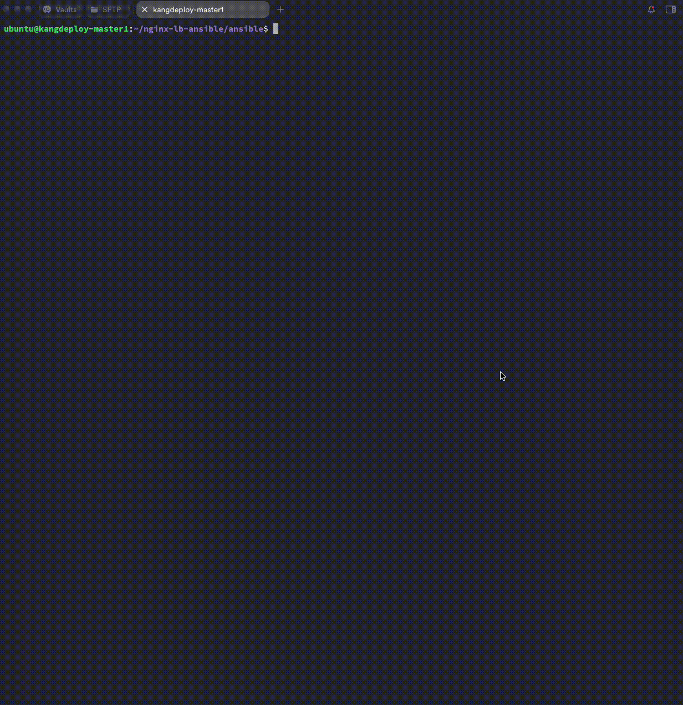

# Ansible NGINX Load Balancer & Docker Compose Web Apps

## Requirements
- Ubuntu-based machines
- Ansible >= 2.10
- Access to 10.184.0.2 (nginx LB) and 10.184.0.5 (web apps)

#This project uses **Ansible** to:

- Deploy 3 web applications based on NGINX on a single host (`10.184.0.5`) using Docker Compose.
- Set up an NGINX Load Balancer on a separate host (`10.184.0.2`) with TLS termination and round-robin configuration to backend services.

Each NGINX application (`app1`, `app2`, `app3`) serves a different `index.html` page:
- `app1` displays: **nginx app1**
- `app2` displays: **nginx app2**
- `app3` displays: **nginx app3**

This differentiation allows you to clearly observe the **round-robin** behavior of the load balancer when testing with `curl`.

---

## Requirements

- Ansible 2.9+
- SSH access to:
  - Host `10.184.0.2` (NGINX Load Balancer)
  - Host `10.184.0.5` (Docker-based web apps)
- Python installed on both hosts
- Docker and Docker Compose on the backend host

### Test
```bash
curl -k https://10.184.0.2
```
#### Verification: 3 WebApp Deployment



#### Verification: Test Function Loadbalancer


This setup uses:
- NGINX upstream config with round-robin
- Self-signed SSL
- Docker backends exposed on different ports